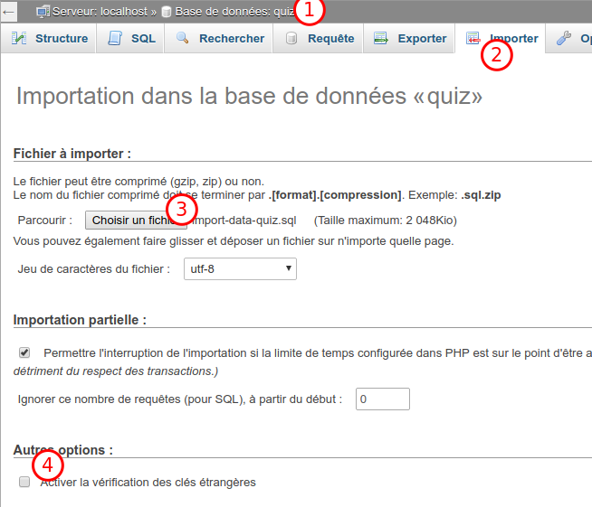

# Guide import des données

Suivez ces étapes pour importer la strcuture de la base de données et ses données :

1. Créez un utilisateur MySQL avec le nom de la base de données, et cocher la case "Créer une base de données portant le même nom ..."
2. Sélectionnez la base de données créée (photo "1")
3. Onglet "Importer" (photo "2")
4. Choisissez le fichier contenant la structure de la base de données : `import-quiz.sql`  (photo "3")
5. Bouton _Exécuter_
6. Onglet "Importer" (photo "2")
7. Choisissez le fichier contenant les données : `import-data-quiz.sql` (photo "3")
8. **Décochez l'option** : _Activer la vérification des clés étrangères_ (photo "4")
9. Bouton _Exécuter_

En cas d'erreur refaites toutes les étapes.

